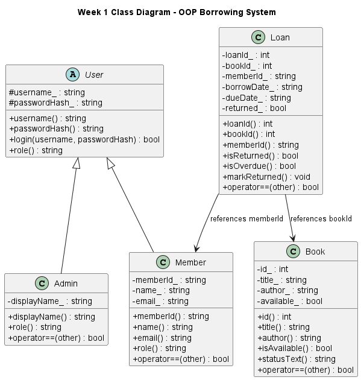

# OOP Borrowing System

Mini Project for Object-Oriented Programming (C++)
Department of Electrical Engineering and Information Technology (DTETI)
Universitas Gadjah Mada

## Author

- Name: Muhammad Razza Titian Jiwani
- NIM: 21/475348/TK/52470
- Course: Object-Oriented Programming (C++)

---

## Project Description

OOP Borrowing System is a borrowing management application developed using C++17 and Object-Oriented Programming principles.

The system allows administrators to manage books, members, loans, reservations, and borrowing workflows through a command-line interface while maintaining persistent data storage using CSV files. The project also includes a web interface powered by `cpp-httplib`, allowing the same backend engine to be accessed through a browser.

The architecture follows a layered design:

```txt
Admin CLI / Web UI
          ↓
      Services
          ↓
    Repositories
          ↓
      CSV Files
```

---

## Features

### Core Features

- Book management
- Member management
- Admin management
- Loan management
- Borrow book workflow
- Return book workflow
- Persistent CSV storage

### Additional Features

- Generic Repository<T, ID>
- Book search (case-insensitive)
- Loan history tracking
- Password hashing
- Reservation queue system
- Service layer architecture
- Admin authentication
- Active loan protection
- Member validation
- Web interface (in progress)

---

## Technologies Used

- C++17
- CMake
- CSV Persistence
- cpp-httplib
- PlantUML
- Git
- GitHub

---

## OOP Concepts Used

### Encapsulation

All class attributes are private or protected and accessed through public methods.

### Inheritance

```txt
User
├── Admin
└── Member
```

### Polymorphism

The `User` class defines a pure virtual method:

```cpp
virtual std::string role() const = 0;
```

which is implemented by derived classes.

### Operator Overloading

Implemented using:

```cpp
operator==
operator<<
```

for model classes.

### Generic Programming

Implemented using:

```cpp
template<typename T, typename ID>
class Repository
```

---

## Architecture

The project follows a layered architecture to separate responsibilities and improve maintainability.

```txt
Admin CLI / Web UI
          ↓
      Services
          ↓
    Repositories
          ↓
      CSV Files
```

### Responsibilities

#### CLI / Web Layer

Handles user interaction.

Examples:

- Admin login
- Book management
- Member management
- Loan workflow
- Browser-based access

#### Service Layer

Contains business logic and validation rules.

Examples:

- Borrowing books
- Returning books
- Reservation handling
- Active loan protection
- Member validation

#### Repository Layer

Handles persistence operations.

Examples:

- save()
- findById()
- listAll()
- remove()

#### Storage Layer

Stores application data in CSV files.

---

## UML Class Diagram

### Diagram



### PlantUML Source

- [week1_class_diagram.puml](docs/week1_class_diagram.puml)

---

## Project Structure

```txt
include/
├── cli/
├── external/
├── models/
├── repositories/
├── services/
├── utils/
└── web/

src/
├── cli/
├── models/
├── repositories/
├── services/
├── utils/
└── web/

data/
├── admins.csv
├── books.csv
├── loans.csv
├── members.csv
└── reservations.csv

docs/
├── week1_class_diagram.puml
└── week1_class_diagram/
    └── uml.png
```

---

## Persistence Layer

CSV repositories:

- CsvBookRepository
- CsvMemberRepository
- CsvAdminRepository
- CsvLoanRepository
- CsvReservationRepository

Supported operations:

```cpp
save()
findById()
listAll()
remove()
```

Data persists across multiple program executions.

---

## Week 1 Deliverables

### Core OOP Engine

Implemented classes:

- User (abstract)
- Admin
- Member
- Book
- Loan
- Reservation

### Database Layer

Implemented CSV persistence using:

- CsvBookRepository
- CsvMemberRepository
- CsvAdminRepository
- CsvLoanRepository
- CsvReservationRepository

### Sample Data

The project includes sample data stored in:

- admins.csv
- books.csv
- loans.csv
- members.csv
- reservations.csv

Data persists across multiple program executions.

---

## Build Instructions

### Requirements

- C++17
- CMake 3.16+
- Visual Studio Build Tools / MSVC

### Build

```bash
cmake -B build
cmake --build build --config Debug
```

### Run Admin Console

```bash
.\build\Debug\oop_project.exe admin
```

### Run Web Server

```bash
.\build\Debug\oop_project.exe web
```

Open:

```txt
http://localhost:8080
```

---

## Current Progress

### Week 1

Completed:

- UML design
- Core OOP models
- Repository layer
- CSV persistence
- Borrowing workflow
- Return workflow

### Week 2

Completed:

- Admin authentication
- Admin CLI
- Book management
- Member management
- Loan workflow
- Reports
- Validation
- Reservation queue
- Password hashing

### Week 3

Completed:

- Web server module using cpp-httplib
- Homepage route (`GET /`)
- Full book catalog (`GET /books`)
- Book details page (`GET /book?id=...`)
- Search route (`GET /search?q=...`)
- Borrow route (`POST /borrow`)
- Return route (`POST /return`)
- Member loan history page (`GET /me?id=...`)
- Homepage pagination
- Library statistics dashboard
- API documentation page (`GET /api`)
- JSON API endpoints:
  - `GET /api/books`
  - `GET /api/members`
  - `GET /api/loans`
  - `GET /api/stats`
- CSV export endpoints:
  - `GET /export/books`
  - `GET /export/members`
  - `GET /export/loans`

---

## License

This project was developed for educational purposes as part of the Object-Oriented Programming (C++) course at Universitas Gadjah Mada.
